# AI Usage Monitoring setup

> This guide is part of cmux's AI provider accounts feature. See [providers.md](providers.md) for the generic provider model and how to add other providers.

cmux can show your AI provider subscription usage (Session and Week limits) directly in the sidebar footer, with one row per account. Each provider is configured independently; you can add several accounts per provider (e.g. Personal and Work).

<p align="center">
  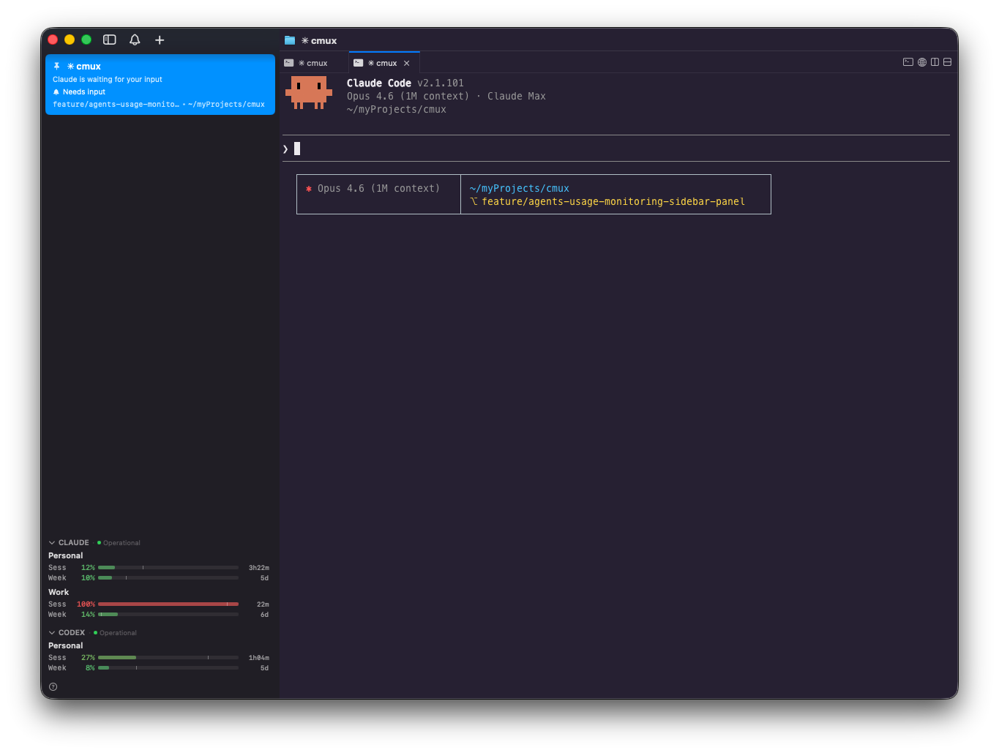
</p>

All credentials are stored **only in macOS Keychain**, under a per-provider service name. They are never written to disk in plaintext, never sent anywhere except the provider's own API, and never logged.

> ⚠️ **Treat every credential in this guide as a password.** Anyone who has it can read your account data and act as you on the provider's site. Do not share, paste into chats, or commit to git. If a credential leaks, rotate it using the steps in the provider-specific section below.

---

## Reading a usage bar

Each row in the sidebar is one account and contains two bars:

- **Sess** — consumption of the current short (5-hour rolling) window.
- **Week** — consumption of the current weekly window.

<p align="center">
  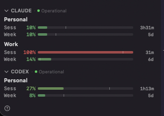
</p>

The coloured fill is the percentage of the quota you've used. The **vertical silver line** on the same bar is the *time-pace marker*: it shows how far you've progressed through the window in elapsed time. If the silver line is ahead of the coloured fill, you're pacing under your quota; if the fill has caught up to or passed the silver line, you're consuming faster than a linear pace and will likely hit the limit before the window resets. The number on the right (`3h31m`, `5d`, etc.) is the time left until the window resets.

When a window's reset timestamp isn't returned by the API, the silver line is omitted for that bar — the bar still works, cmux just can't compute pace for it.

---

## Adding an account in cmux

The flow is the same for all providers:

1. Open **cmux → Settings → AI Usage Monitoring**. When no accounts are configured yet, you'll see empty `CLAUDE` and `CODEX` sections with just an **Add profile…** button.

   <p align="center">
     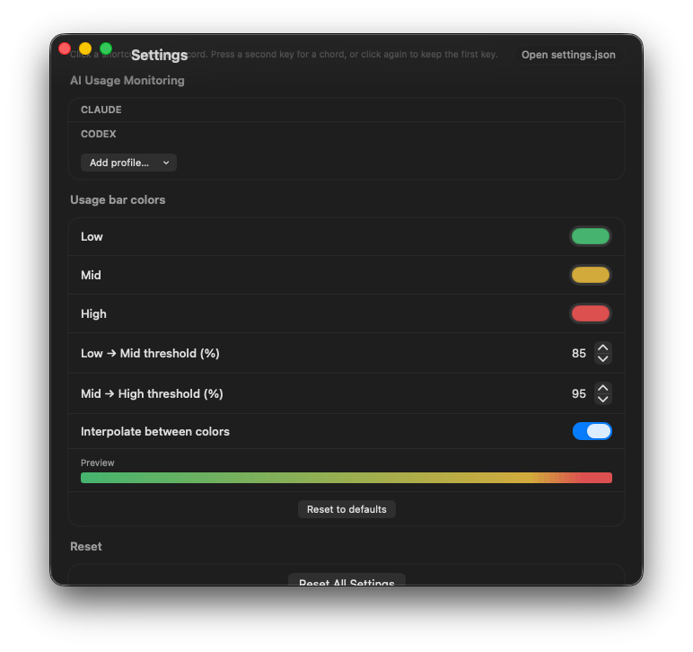
   </p>

2. Click **Add profile…** and pick the provider you want to configure.

   <p align="center">
     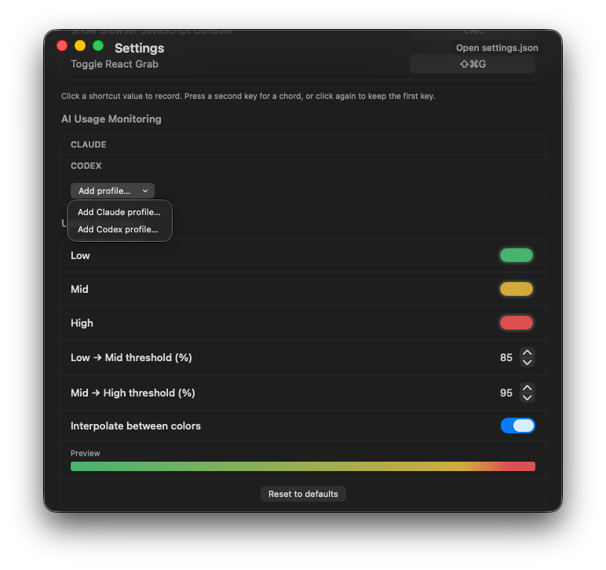
   </p>

3. Fill in the **Display name** (any label you want — `Personal`, `Work`, etc. — shown in the sidebar footer) and the credential fields for the chosen provider. Per-provider details are below.

   <p align="center">
     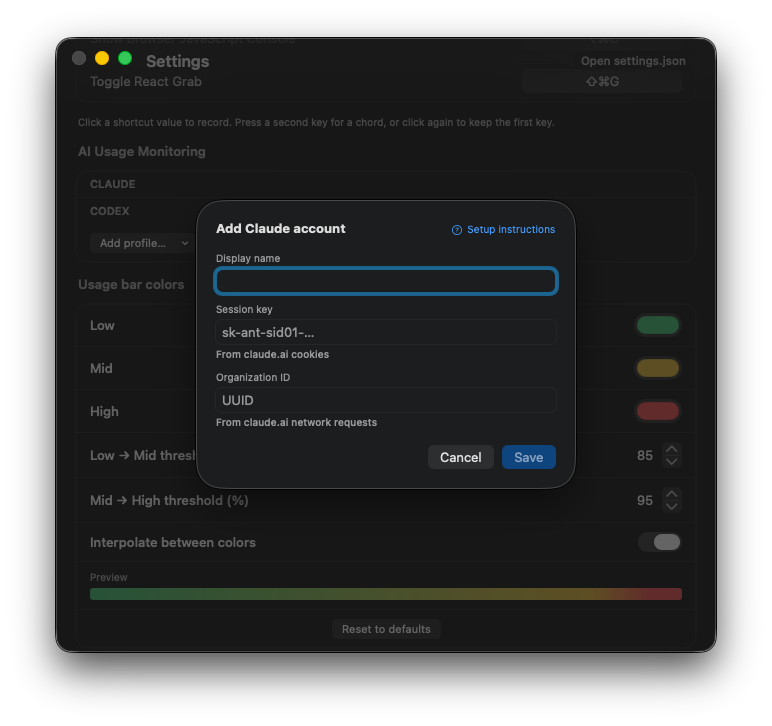
     &nbsp;&nbsp;
     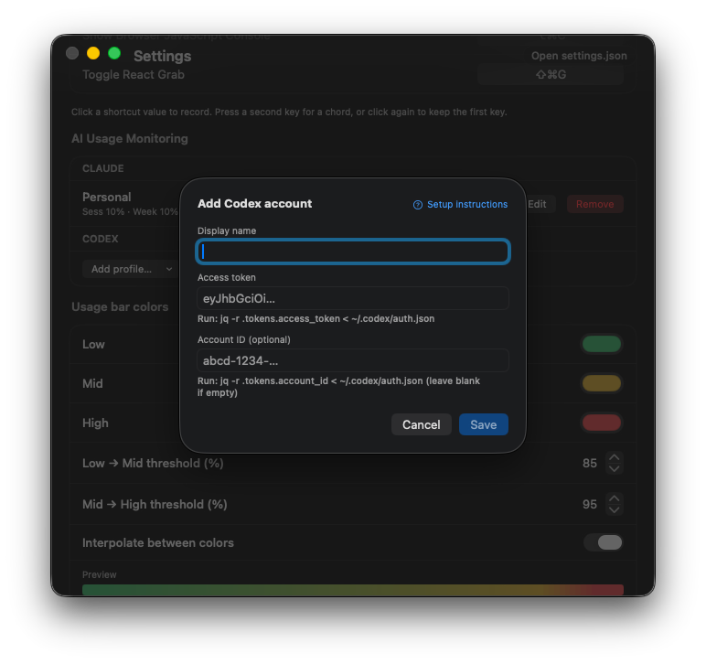
   </p>

4. Click **Save**. You can repeat the flow to add multiple accounts per provider — they stack in the same section.

   <p align="center">
     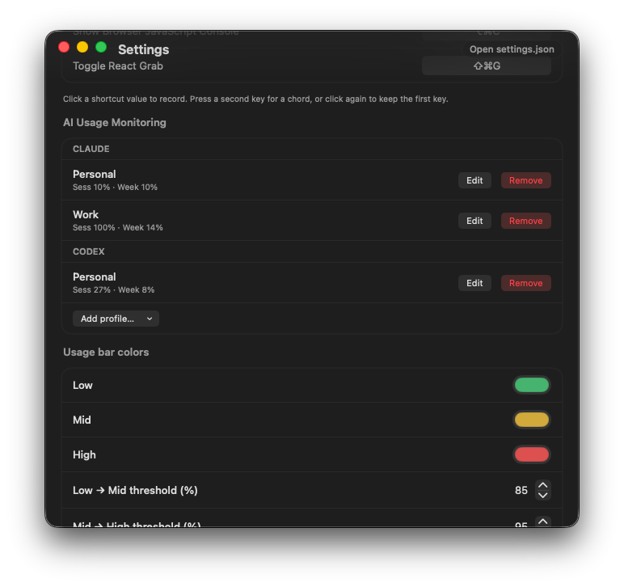
   </p>

Within a few seconds the new account appears in the sidebar footer with two progress bars (Session and Week) and refreshes once a minute. You can collapse a provider section by clicking its header when you don't need the details on screen — the status dot stays visible:

<p align="center">
  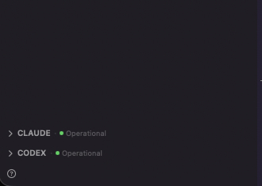
</p>

The section for a provider is hidden entirely when no accounts are configured for it.

### Reset time popover

Hover or click a row to open a popover with the exact reset times, the provider's status-page summary, and quick actions (**Refresh now**, **Manage accounts…**). Reset times are rendered as `Today HH:mm`, `Tomorrow HH:mm`, or `MMM d, HH:mm` depending on how far in the future the reset is, with the relative countdown in parentheses.

<p align="center">
  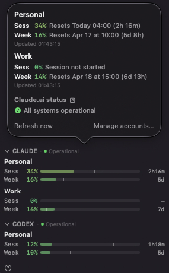
  &nbsp;&nbsp;
  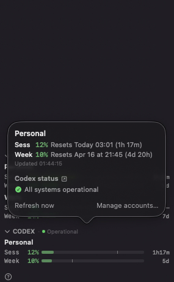
</p>

### Provider service status

Each provider section header also shows a live status indicator pulled from the provider's public status page (`status.claude.com` for Claude, `status.openai.com` for Codex). cmux polls the unauthenticated incidents feed and surfaces the worst unresolved incident next to the provider name:

- 🟢 **Operational** — no unresolved incidents.
- 🟡 **Minor issue** — a `minor` severity incident is active.
- 🟠 **Major issue** — a `major` severity incident is active.
- 🔴 **Critical issue** — a `critical` severity incident is active.

When an incident is active, the popover expands to show the incident title, severity, and current update status (e.g. `Investigating`, `Identified`, `Monitoring`). Clicking the link icon next to the status header opens the provider's full status page in your browser. The example below shows Claude reporting a minor degradation on its usage and analytics admin API while Codex stays operational — the sidebar still renders the bars normally, but you now know a 401/empty response may be upstream rather than a credential problem:

<p align="center">
  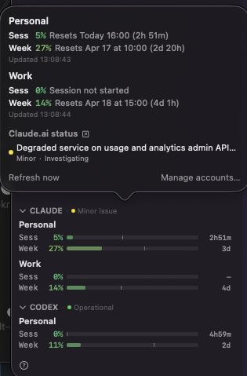
</p>

Status lookups are cached and refreshed on the same 60s tick as usage data; if the status feed itself is unreachable, the dot falls back to the last known state rather than reporting a false outage.

---

## Claude

- **Keychain service**: `com.cmuxterm.app.claude-accounts`
- **Credentials**:
  - `sessionKey` — the cookie that identifies you to claude.ai (treated like a password)
  - `Organization ID` — the UUID of the organization the usage data belongs to

### How to get your `sessionKey`

1. Open <https://claude.ai> in **Chrome, Edge, Brave, any Chromium browser, or Firefox** and sign in with the account you want to track.
2. Open DevTools:
   - macOS: `⌥⌘I` (Option + Cmd + I)
   - or right-click anywhere on the page → **Inspect**
3. Go to the **Application** tab (in Firefox this tab is named **Storage**).
4. In the left sidebar of DevTools, expand **Cookies** → click `https://claude.ai`.
5. Find the row whose **Name** is `sessionKey`.
6. Double-click its **Value** cell and copy the entire string (it's long — usually starts with `sk-ant-sid01-…`).

#### Alternative: Network tab

If you can't find the cookie, you can grab it from a request header instead:

1. Open DevTools → **Network** tab.
2. Reload <https://claude.ai>.
3. Click any request to `claude.ai/api/...` in the request list.
4. In the **Headers** panel, scroll to **Request Headers** → **Cookie**.
5. Find the `sessionKey=…` substring and copy just the value (everything between `sessionKey=` and the next `;`).

### How to get your `Organization ID`

cmux fetches usage from `https://claude.ai/api/organizations/{orgId}/usage`, so it needs the right `orgId`. Two ways to find it:

**Option A — From the Network tab**

1. Still in DevTools → **Network** tab on <https://claude.ai>.
2. Reload the page.
3. In the filter box at the top of the Network tab type: `organizations`.
4. Click any request whose URL looks like `https://claude.ai/api/organizations/<UUID>/...`.
5. Copy the `<UUID>` segment after `/organizations/`.

**Option B — From the URL bar**

If you switch organizations in claude.ai, the URL sometimes contains the organization UUID directly. Open `https://claude.ai/account` and look for a UUID-shaped string in the page or in any of the requests it makes.

### Claude troubleshooting

| Symptom | Meaning | Fix |
|---|---|---|
| Red ⚠ icon, tooltip says "401" or "403" | The session key is expired or wrong | Re-grab `sessionKey` from claude.ai cookies and **Edit** the account |
| Red ⚠ icon, tooltip says "404" | Wrong `orgId` for this account | Re-grab `orgId` from the Network tab and **Edit** |
| Red ⚠ icon, tooltip says "network error" | Offline or claude.ai unreachable | Check your network; cmux will recover on the next 60s tick |
| Bars show but the silver pace tick is missing | The reset time wasn't returned by the API for that window | Harmless — cmux can't compute pace for that window right now |

### Claude credential lifetime

Claude.ai cookies are typically valid for several weeks unless you explicitly sign out, change your password, or revoke sessions. When the cookie expires you'll see a `401`/`403` error in the panel — just re-grab a fresh `sessionKey` from DevTools and click **Edit** on the account.

---

## Codex

- **Keychain service**: `com.cmuxterm.app.codex-accounts`
- **Credentials**:
  - `accessToken` — the JWT that identifies you to chatgpt.com (treated like a password)
  - `accountId` *(optional)* — the UUID of the account the usage data belongs to

### Prerequisite

You must already be signed in to the Codex CLI or desktop app. If you haven't done so, run:

```bash
codex login
```

This creates `~/.codex/auth.json` with the credentials cmux needs.

### How to get your `accessToken` and `accountId`

The simplest way is to use `jq` to extract the values from Codex's auth file:

```bash
jq -r '.tokens.access_token' < ~/.codex/auth.json
jq -r '.tokens.account_id'   < ~/.codex/auth.json
```

Or open `~/.codex/auth.json` in a text editor — but `jq` is cleaner and avoids accidentally selecting surrounding quotes or whitespace.

If `account_id` is `null`, leave the **Account ID** field in cmux blank.

#### Keychain alternative

If `cli_auth_credentials_store = "keyring"` is set in `~/.codex/config.toml`, the values live in macOS Keychain instead of `~/.codex/auth.json`. Use **Keychain Access** to find them under the Codex service.

### Codex troubleshooting

| Symptom | Meaning | Fix |
|---|---|---|
| Red icon, tooltip mentions 401/403 | `access_token` JWT expired (Codex rotates these every few hours) | Re-run the `jq` command above — the file is auto-refreshed by the Codex CLI — and click **Edit** on the cmux account to paste the new value |
| Red icon, tooltip mentions 404 | `account_id` is wrong or unset for an account that requires it | Re-run `jq -r .tokens.account_id < ~/.codex/auth.json`; if it's `null`, leave the cmux field blank |
| Red icon, tooltip says "Failed to parse Codex rate_limits" | OpenAI changed the wire format | Open an issue on the cmux repo with the response body |
| Bars show but the silver pace tick is missing | The reset time wasn't returned by the API for that window | Harmless — cmux can't compute pace for that window right now |

### Codex credential lifetime

Codex's `access_token` is a short-lived JWT (typically minutes to hours). The Codex CLI auto-refreshes it via the stored `refresh_token`, so as long as you run `codex` periodically, `~/.codex/auth.json` stays fresh. cmux does not implement refresh — when the token expires you'll see a 401 error in the cmux panel. Re-run the `jq` command to get the latest token and click **Edit** on the account to paste it.

---

## Customising the usage bar colors

Below the account list, the **Usage bar colors** subsection lets you change how the bars are painted:

- **Low / Mid / High** color pickers — the three stops used for the fill.
- **Low → Mid threshold (%)** and **Mid → High threshold (%)** — the utilization percentages at which the fill switches color. Defaults are `85` and `95`.
- **Interpolate between colors** — when on, the fill smoothly blends between the three stops across the whole 0–100% range (producing the gradient visible in the **Preview** bar). When off, the bar uses the discrete `Low` / `Mid` / `High` color for each threshold band.
- **Reset to defaults** — restores the built-in green / amber / red palette and thresholds.

The **Preview** bar at the bottom of the subsection is live — it updates as you adjust the pickers and thresholds, so you can tune the colors without having to open the sidebar.

Color settings are global across all providers and all accounts; they're stored in cmux's settings.json so they persist across restarts.

---

## Security & privacy notes

- All credentials are stored in macOS Keychain under per-provider service names (`com.cmuxterm.app.claude-accounts`, `com.cmuxterm.app.codex-accounts`). You can inspect them with **Keychain Access** or:

  ```bash
  security find-generic-password -s com.cmuxterm.app.claude-accounts
  security find-generic-password -s com.cmuxterm.app.codex-accounts
  ```

- cmux talks only to each provider's own API endpoints:
  - **Claude**: `https://claude.ai/api/organizations/{orgId}/usage` plus the unauthenticated `https://status.claude.com/api/v2/incidents.json` (unresolved incidents filtered client-side)
  - **Codex**: `https://chatgpt.com/backend-api/wham/usage` with `Authorization: Bearer <accessToken>` and optional `chatgpt-account-id: <accountId>` headers, plus the unauthenticated `https://status.openai.com/api/v2/incidents.json` (unresolved incidents filtered client-side)
- cmux does **not** read or write `~/.claude/settings.json` or `~/.codex/auth.json`. Credentials are entered manually and stored only in Keychain.
- Credentials are not exported, not synced, not telemetry'd. Removing an account from Settings deletes the corresponding Keychain entry.

---

## See also

- [providers.md](providers.md) — cmux's generic provider model and architecture
- [Claude Usage Tracker](https://github.com/hamed-elfayome/Claude-Usage-Tracker) — reference project for the Claude DevTools walkthrough (its "Option C: Manual setup with session key" section has screenshots)
- [Codex CLI repository](https://github.com/openai/codex) — Codex CLI source code and issue tracker
